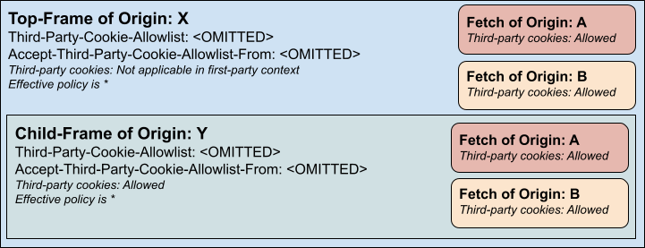
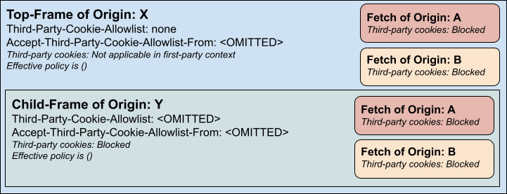
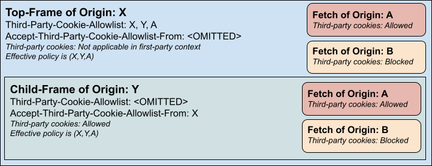
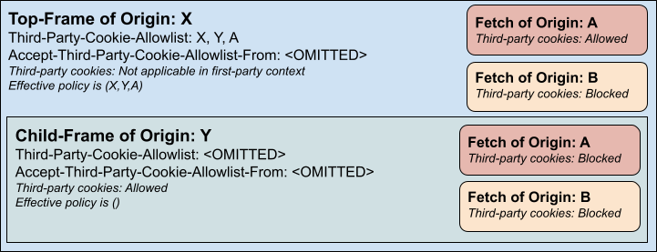
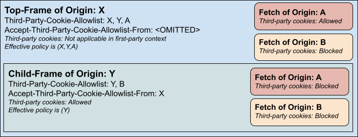
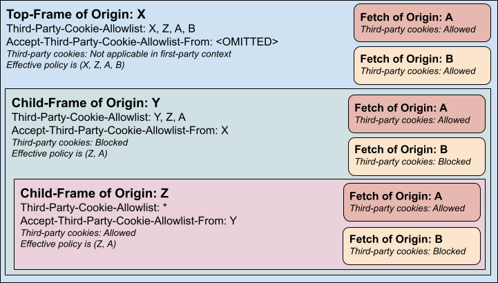

# Explainer: Third-Party Cookie Allowlist Header

This proposal is an early design sketch to describe the problem below and solicit feedback on the proposed solution.
It has not been approved to ship in Chrome.

* [Discussion](https://github.com/explainers-by-googlers/third-party-cookie-allowlist-header/issues)

## Introduction

Today, websites have limited control over third-party origins storing/reading cookies.
This includes, but not limited to, circumstances where third parties are compromised (such as when an imported script abuses access to perform disallowed actions) or layered (such as, an advertising service that has content served by another party).
This may raise trust issues that are not technically verifiable, for example in the case of compliance with local data protection and privacy laws.

In these circumstances, websites may desire controls in limiting third-party origins from storing or reading cookies.
Although third-party cookies are not the only storage vector for such cases, they are a key mechanism that many sites wish to make representations to their users or regulators about.

## Goals

* Allow the top-level site to provide an allowlist of origins which can access third-party cookies.
* Allow child frames to further restrict the list of origins which can access third-party cookies.
* When this allowlist is provided, deny access to third-party cookies to all other origins.
* Require consent of child-frames where specific lists (instead of none or all) will be enforced.

## Non-goals

* Override controls to allow access to third-party cookies where access would otherwise be denied.
* Change behaviors related to third-party cookies where the allowlist is not provided.
* Provide a mechanism to change the allowlist during the document’s lifecycle.
* Allow child-frames to escape parental restrictions through lack of participation.

## Use cases

### Website with cookie-related notice

A website has a notice that provides transparency about the third parties it works with for various purposes and it wants to limit the use of third-party cookies by any third-party not listed.
A website has a notice that asks for permission related to third-party cookies used by that website’s advertisers.
If the user denies the use of third-party cookies, the website wants a way to prevent a given origin from accessing or setting them via a browser control. 

### Website with sensitive content

A website with sensitive content wants to prevent its users from being tracked by third-party resources it has to fetch/embed to function.
Third-party cookies are a key tracking vector, and controls related to them would improve user privacy (even if it does not guarantee it).

## Proposed Solution

We propose two new headers, which together allow parent frames to enforce third-party cookie restrictions and child frames to actively consent or passively reject selective enforcement.

### Third-Party-Cookie-Allowlist

This HTTP response header is supported only on navigation, and supports three values:

* The token `*`, the default value if the header is omitted, which represents allowing third-party cookie access where it would otherwise be permitted for all sub-requests and sub-frames.
* The token `none`, which represents blocking third-party cookie access from all sub-requests and sub-frames.
  Note that this will not remove access to third-party cookies from the frame itself as cookies would already have been sent in the HTTP request.
* A list of origins as strings, which will be the only origins that sub-requests or sub-frames could have third-party cookies attached to.
  As with `*` this does not force access to third-party cookies to those origins, it simply does not deny access that would otherwise have been granted.

The enforced policy on a child frame is the set intersection of the Third-Party-Cookie-Allowlist value (or default value) of the child frame and the enforced policy on its parent (if a parent exists).
See the examples section for details.

### Accept-Third-Party-Cookie-Allowlist-From

This HTTP response header is supported only on navigation, and supports three values:

* The token `*`, which allows this frame to inherit the policy of any parent frame.
* An empty value, the default value if the header is omitted, which causes this frame to accept only all (`*`) or nothing () policies from the parent, but not specific lists of origins.
  If the parent did set a specific list of origins, it will be treated as though they set ().
  This is the default to prevent selective targeting of origins for third-party cookie blocking in a way the frame would not want to allow.
* A list of origins as strings, which allow inheritance of the parental policy if the parent origin is on the list and deny inheritance (with behavior the same as the empty value) otherwise.

Note that denied inheritance will not remove access to third-party cookies from the frame itself as cookies would already have been sent in the HTTP request.
See the examples section for details.

### Example

For each of these examples assume the browser allows third-party cookies by default.

Most of the internet likely won’t adopt these headers, and for them behavior would not change (no child frame consent is needed for policies of all):

A top-frame could prevent all sub-requests and sub-frames from using cookies by setting a `none` allowlist (no child frame consent is needed for policies of nothing):

A top-frame could set a selective policy, but the child frame would need to accept it:

If the top-frame set a selective policy but the child frame didn’t accept it, then it would be as though the child inherited a policy of accepting no third-party cookies

If the child frame accepted the parent policy, it could further restrict it as desired but cannot expand it:

This pattern holds even across multiple levels of nesting:

### Integrations

This header does not block access to [CHIPS](https://privacysandbox.google.com/cookies/chips) (partitioned) cookies or other partitioned storage/communication mechanisms (such as session storage, IndexedDB, or SharedWorkers) in third-party contexts.

Cross-origin frames/requests blocked from third-party cookie access via this header could still restore access via the [Storage Access API](https://developer.mozilla.org/en-US/docs/Web/API/Storage_Access_API) or [Storage Access Headers](https://privacysandbox.google.com/cookies/storage-access-api#sah) (which would behave as it would in any context where third-party cookie access had been denied).

Insecure origins cannot be added to the allowlist.

## Alternatives Considered

### Permissions Policy Feature

We considered offering this control as a new feature on the existing [Permissions Policy Header](https://developer.mozilla.org/en-US/docs/Web/HTTP/Guides/Permissions_Policy), but unlike other permissions this one does not cascade controls to sub-frames.
The top-level frame is in full control of access while subframes can just further restrict access.
We worried that adding it as ‘just another’ permissions policy feature would make it seem as though it was a permission that parent frames could delegate control of to child frames.

### Blocklist

Instead of an allowlist, we could have gone for a blocklist approach, but to be effective that would require a website to already know all origins being fetched from—and part of the reason for this control was the potential lack of transparency into that.
An allowlist should ensure better intentionality, and hopefully requires fewer entries than a blocklist would have.

### Mid-Lifecycle Changes

The ability to change the policy of a document mid-lifecycle (for example, without requiring a reload of the page) might be requested, and could be implemented, but would make it harder for third parties to understand the environment they are executing in.
Instead of checking constraints once at initialization, checks would need to be performed each time any operation related to them was performed.
This will likely compound compatibility issues in a way that fixed restrictions would not (such as whether third-party cookies are or aren’t available).

### JavaScript API

The ability to set the policy of a document via JavaScript (mid-lifecycle) was considered but rejected due to the complexity of accommodating multiple scripts attempting to set the list independently.
You could introduce an API that only respected the first update request, but then you encourage a race to use the API first.
On the other hand you could provide an API that allowed for overriding or extending the list, but then whatever script wanted to restrict access can no longer be sure it was effective.

## Privacy & Security Considerations

### Parental Policy Information

We require the child frame to consent to the origin of the parent frame for setting specific allowlist policies (aside from all or nothing) to ensure this header can’t be used to selectively target some resources in a way the child frame would not want.
We could share the exact parental policy in an HTTP request header, but there is a concern that this could expose too much sensitive information as origins in a parental policy are there to permit access across all of its sub-requests and sub-frames, and thus would expose information about other iframes/resources being used.

### User Setting Override

This header should never allow access to third-party cookies where it would otherwise have been denied, it should only deny access where it would otherwise have been granted.
Browser and origin-specific settings related to third-party cookie blocking must be respected.

### Other Windows

Blocking access to third-party cookies in subresource/navigation fetches, for a given top-level site, does not prevent other tracking methods.
For example, a third-party iframe could open a popup (which then would have access to first-party cookies) and transmit data which would allow tracking in the third-party context.
This issue exists even where all third-party cookies are blocked, and requires mitigation via other methods not described here.

### Cross-Origin Attacks

It’s possible this setting could be used to assist in cross-origin attacks by denying information (i.e., third-party cookies) that might otherwise be included in cross-origin subresource requests or sub-frame navigations.
Ensuring this setting does not block access to [CHIPS](https://privacysandbox.google.com/cookies/chips) should mitigate this concern somewhat, but it’s worth noting that the setting does deny some anti-abuse signals which might otherwise be available.

## UX Considerations

In existing browser surfaces concerned with whether third-party cookies are allowed or blocked for a given tab (such as developer tools or site settings), third-party cookie access blocking due to this header should be reflected to assist with user understanding and developer debugging.

## Future Work

### Well-Known File

The list of origins needing to be granted access could be extensive for some websites, and although we hope the wildcard matching on subdomains can help curtail the list, it might become cumbersome to transmit the list in a header on every navigation.
It may make sense to support some sort of [well-known location](https://en.wikipedia.org/wiki/Well-known_URI) that has the allowlist so it can be fetched/cached independently.
For the moment we leave this to future work, as it seems a natural extension of the header (for example, a new token like `well-known` could be included in the allowlist to indicate that the browser should fetch additional entries from there).

### API Endpoint

Instead of checking a [well-known location](https://en.wikipedia.org/wiki/Well-known_URI) for allowlists or to check individual origins, we could provide a way to point a site to some endpoint (such as a [REST API](https://en.wikipedia.org/wiki/REST) that took the origin in question as a query parameter) which could provide the needed information. The downside is that more requests might be required here (if all needed information cannot be provided in a single go).

### HTML Tag

Instead of (or in addition to) an HTTP response header, we could allow an [http-equiv](https://developer.mozilla.org/en-US/docs/Web/HTML/Reference/Elements/meta/http-equiv) meta tag to set the third-party cookie allowlist.
In order to prevent this from counting as a mid-lifecycle change, we could restrict the tag to only be respected if it was present in the page before JavaScript started to execute and fetches started to be performed.
This would ensure the tag originated from the server and wasn’t injected by a third-party script in an attempt to weaken controls.

### Additional Controls

There may be top-level site privacy settings beyond third-party cookies (such as even  blocking access to partitioned storage in third-party contexts) that could use a model similar to an allowlist header to provide better guarantees for user privacy.
We did not design the proposed header as a generic control, as every surface is likely to have unique constraints that might not play well together in a shared header with multiple features (similar to the reason we did not extend the [Permissions Policy Header](https://developer.mozilla.org/en-US/docs/Web/HTTP/Guides/Permissions_Policy)).
